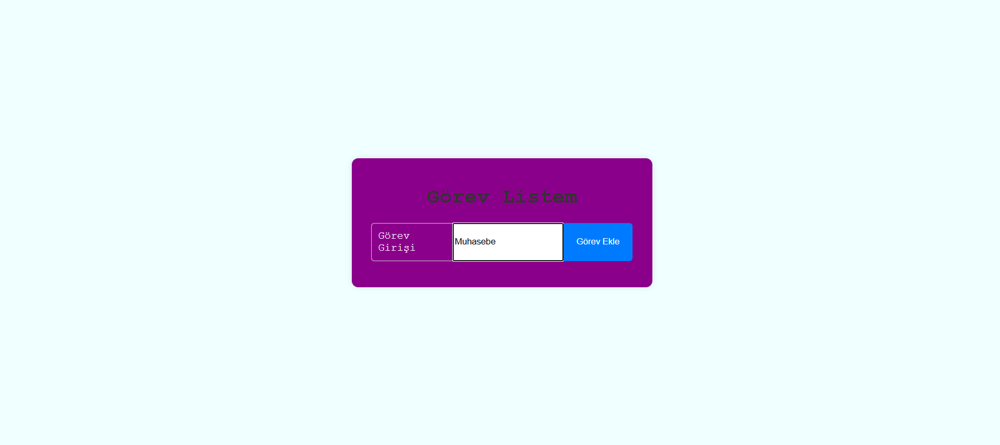

#  📝 GÖREV LİSTEM

Bu proje, basit HTML, CSS ve JavaScript kullanılarak geliştirilmiş bir görev listesi uygulamasıdır. Kullanıcılar görevlerini ekleyebilir ve tamamladıklarında silebilirler.

---

###  🚀 Özellikler

1. Görev Ekleme
2. Görev Silme
3. Temiz ve Modern Tasarım

---

###  🛠️ Kullanılan Teknolojiler

- HTML
- CSS
- Javascript

---

###  📷 Ekran

